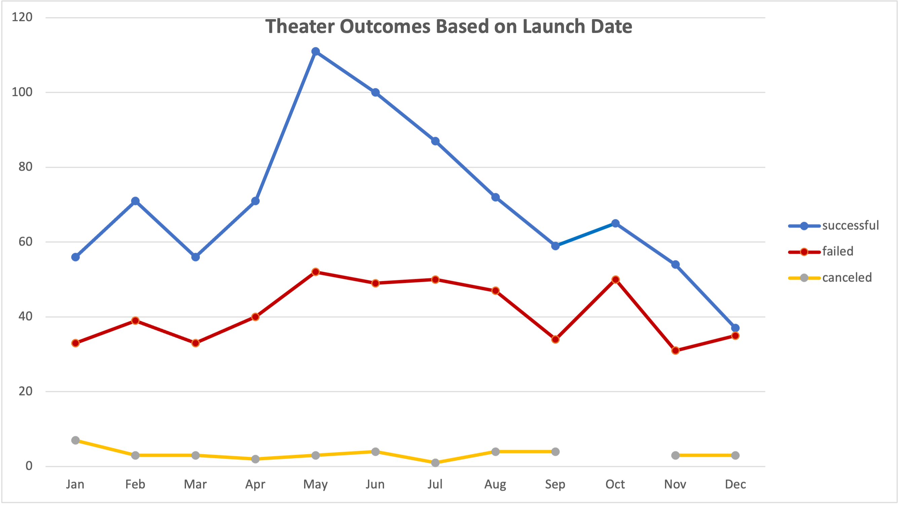
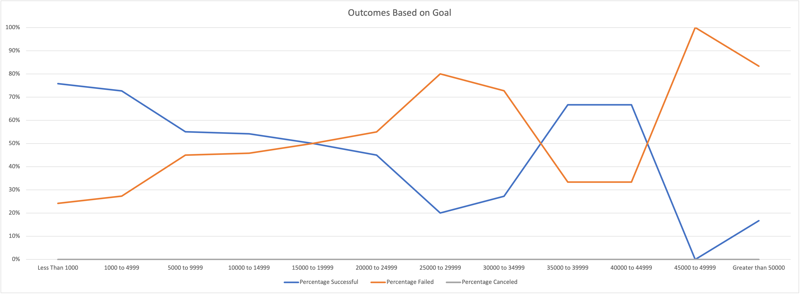

# Kickstarting with Excel

## Overview of Project

An analysis of Kickerstarers for Louise

### Purpose

We are trying to determine what level of kickstarter would be ideal.  We're hoping to find on that accomplish's Louise's production goals and is feasible based on her level of risk an current financial means.

## Analysis and Challenges

We started with historical data on how previous kickerstaters where produced. We have data on what the kickstarter goals for various previous programs were, where they successful in reaching those goals, did they ultimately produce a show or were they cancelled before production.

In order to determine the proper kickerstarer goals that give us the best chance for success we analyzed the data in two ways:  

* What are the characteristics of successful, kickstarted productions?
* What were the goal levels of those succssful, kickstarted productions?

### Analysis of Outcomes Based on Launch Date

### Analysis of Outcomes Based on Goals

### Challenges and Difficulties Encountered

In Theater Outcomes vs Launch:

In Outcomes vs Goals
What isn't taken into account are the kickerstaters that were neither succssful, failed, or cancelled.  Those numbers skewed the results against succsful kickerstarters.

## Results

- What are two conclusions you can draw about the Outcomes based on Launch Date?
Launching in late spring (May) to early summer (Jul) gives Louise the best chance for success.
Launching in December/Jan gives Louise the worst chance for success.

- What can you conclude about the Outcomes based on Goals?
If you set your goals low, you're not guarenteed success.  Goals set at 10000 to 30000 gives close to a 50% chance for success.  If you do need to set your goals high, somewhere around 40000 to 49999 is t he sweet spot.

- What are some limitations of this dataset?
We're pulling historical data that is based on past treads of theater production and ticket sales, it may not be predictive of futurue ticket purchasing behavior.

- What are some other possible tables and/or graphs that we could create?
It certainly would be good to break down treads per region and see if there is any potential for a traveling production. It might also be good to gather data on actual production costs to see if Louise's planned production costs are on par with the norm.  If the costs are much higher maybe there's a production style that is being missed.  